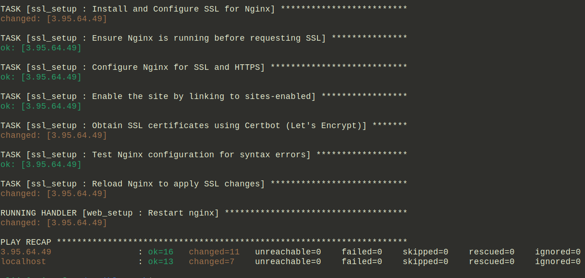

## Prerequisites

Before running the playbook, ensure you have the following installed and configured:

1. **Install Ansible**  
   Ansible must be installed on your local machine to run the playbook. You can install it by following the [official installation guide](https://docs.ansible.com/ansible/latest/installation_guide/index.html).

2. **Install Ansible Collections and AWS Plugin**  
   Install the necessary AWS Ansible collection and AWS plugin to manage EC2 provisioning and DNS configurations.
   ```bash
   ansible-galaxy collection install amazon.aws
   ansible-galaxy collection install cloudflare.cloudflare

3. AWS CLI Configuration
   Ensure your AWS CLI is configured with your AWS credentials and region for EC2 provisioning. Run the following command to configure:
   ```bash
   aws configure


## Instructions for Usage

1. Clone the repository:
   ```bash
   git clone git@github.com:alijarai12/Ansible-Task.git

2. Run the playbook
   ```bash
   ansible-playbook -i aws_ec2.yml playbook.yml


## Images and Screenshots

## Screenshot of Ansible Playbook:




## Screenshot of EC2 Instance:


## Screenshot of SSH SSH Access:


## Screenshot of Webpage:


## Screenshot of SSL Certificate (HTTPS):


## Screenshot of Cloudflare DNS API:

## 

## Screenshot of Cloudflare DNS Record:


